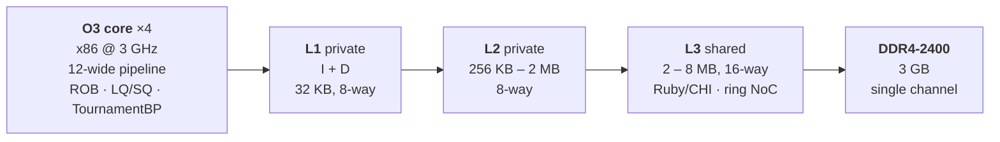
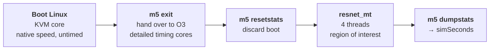

# gem5 — ResNet Workload Hardware Optimization

**Cost-aware design of an x86 out-of-order processor for a multithreaded
ResNet inference workload, and a design-space search for the best
performance per unit of hardware cost.**

I built a full-system gem5 model of a 4-core x86 machine with a 3-level
Ruby/CHI cache hierarchy, booted real Linux on it, ran a multithreaded ResNet
inference kernel, and swept 35 microarchitecture configurations against a
hardware cost model to find where performance stops being worth its price.

📄 **[Full report (PDF)](report.pdf)** · 📊 **[All 35 runs (CSV)](results/auto_results.csv)**

`gem5` · `x86` · `Out-of-Order` · `Ruby/CHI` · `KVM` · `Full-System Simulation` · `Design Space Exploration`

---

## Key results

- Evaluated **35 microarchitecture configurations** using full-system gem5 simulation.
- Reduced ResNet workload execution time from **1.955 ms to 1.476 ms**
  (**1.32× speedup** over baseline).
- `run18` achieved performance within **0.14 % of the fastest configuration** at
  **25.6 % lower modeled hardware cost**; `run8` reached **+29.2 %** performance for
  only **+14.7 %** cost — **1.13×** the baseline's performance-per-cost, the best
  in the sweep.
- Found that **pipeline width and physical-register capacity** had a larger
  performance impact than further increasing cache size for this workload.

| | |
| --- | --- |
| Configurations simulated | **35** |
| Best performance/cost (`run8`) | **+29.2 % faster** at **+14.7 % cost** → **1.13×** the baseline's perf-per-cost |
| Fastest design (`run_opt4`) | +32.6 % faster, but at **+78.6 % cost** |
| Best near-peak value (`run18`) | within **0.14 %** of the fastest, at **25.6 % lower modeled cost** |
| Total performance spread | 35 % between the best and worst configuration |

The interesting finding is not the fastest machine — it is the shape of the
curve: the first **+29.2 %** of performance costs **+102** (`run1` → `run8`),
while the remaining **+2.65 %** costs **+442** (`run8` → `run_opt4`). **The last
2.7 % of performance is 4× more expensive than the first 29 %.**

---

## The system I modeled



Every block in that diagram is parameterized on the command line, and every
parameter is priced by the cost model.

## How a run works

Detailed out-of-order simulation is ~10,000× slower than native, so booting
Linux under it would take days. The fix is to boot fast and measure slow:



The machine boots under KVM at native speed. When `rcS` reaches the end of boot
it calls `m5 exit`, which triggers a live switch to O3 detailed cores. Stats are
reset **after** the switch, so boot time never pollutes the measurement. Only the
workload region is timed:

```
resnet_mt --channels 16 --size 8 --blocks 4 --threads 4
```

`simSeconds` over that region is the score. Each run also writes a
`config_used.txt` recording its exact parameters and cost breakdown, which
[`sort.py`](scripts/sort.py) later scrapes into the results table.

---

## What the sweep showed

**Performance saturates long before cost does.** `run18` matches the fastest
configuration to within 0.14% at **25.6% lower modeled cost** than `run_opt4`, and
**27.4% lower** than `run20`. Past roughly 1 MB of L2 and 4 MB of L3, this
workload stops caring.

**The core, not the cache, is the lever.** Every configuration in the top group
runs uniform 12-wide pipelines with 96 physical registers. `run8` reaches
0.001513 s on just 512 KB of L2 — it spends its budget on ROB and register file
instead of cache, and wins the value ranking outright.

**Narrow decode/rename is what holds the baseline back.** Every run stuck at
≥ 0.0019 s shares the same two traits: `Wd = Wr = 10`, and 50 physical
registers. Widening those two stages alone moves a configuration from the bottom
of the table to the middle.

**Three "obvious" upgrades all lost money:**

| Upgrade | Result |
| --- | --- |
| 6 cores instead of 4 (`run20_6`) | **slower** than the 4-core `run20`, at +39 % cost — the workload does not scale past 4 threads at this size, and the wider ring adds latency |
| Dual-channel memory (`run20_dual`) | 4 % slower, +91 cost — this workload is not bandwidth bound |
| 2 L3 slices (`run_opt2`) | second-slowest run in the sweep — slice crossing cost more than the bandwidth it bought |

### Ranking by performance per cost

Value index = `1 / (simSeconds × cost)`, normalized to the baseline.

| Run | Cost | simSeconds | vs. baseline | Value index |
| --- | ---: | ---: | ---: | ---: |
| **`run8`** | 794 | 0.001513 | +29.2 % | **1.126** |
| `run14` | 791 | 0.001572 | +24.4 % | 1.088 |
| `run7` | 791 | 0.001693 | +15.5 % | 1.010 |
| `run1` *(baseline)* | 692 | 0.001955 | — | 1.000 |
| `run18` | 920 | 0.001476 | +32.5 % | 0.996 |
| … | | | | |
| `run_opt4` *(fastest)* | 1236 | 0.001474 | +32.6 % | 0.743 |
| `run20` | 1268 | 0.001478 | +32.3 % | 0.722 |
| `run20_6` *(6 cores)* | 1758 | 0.001526 | +28.1 % | 0.504 |
| `run_opt2` *(2 L3 slices)* | 1411 | 0.001925 | +1.6 % | 0.498 |

Full 35-row table: [`results/auto_results.csv`](results/auto_results.csv).

---

## Technical details

<details>
<summary><b>Cost model</b> — how each configuration is priced</summary>

Implemented in `write_config_to_file()` in
[`scripts/fs_ex3_edited.py`](scripts/fs_ex3_edited.py). The goal is performance
*per unit cost*, not raw performance, so every knob has a price.

| Component | Cost |
| --- | --- |
| CPU (per core) | `40 + 0.01·score + C_LSQ`, where `score` weights average pipeline width, ROB, physical registers and LQ/SQ |
| L1 | `3 · (L1/16) · cores · 2` (separate I and D) |
| L2 | `(L2/16) · cores` |
| L3 | `(L3/64) · slices` |
| Memory | DDR4-2400, 3 GB, single channel — `1.3 ×` the DDR3 baseline |
| NoC (ring) | `15 · (3·cores + 1 + slices)` routers |

</details>

<details>
<summary><b>Tunable parameters</b> — the full command-line surface</summary>

| Flag | Meaning | Default |
| --- | --- | --- |
| `--Wf --Wd --Wr --Wi --Ww --Wc` | fetch / decode / rename / issue / writeback / commit width | 12, 10, 10, 12, 10, 12 |
| `--ROB` | reorder buffer entries | 50 |
| `--intRegs --fpRegs` | physical register file sizes | 50, 50 |
| `--LQ --SQ` | load / store queue entries | 128, 128 |
| `--cores` | core count | 4 |
| `--L1 --L2 --L3` | cache sizes in KB | 32, 256, 2048 |
| `--L3slices` | shared L3 slices | 1 |

Branch predictor is a `TournamentBP` in all runs.

</details>

<details>
<summary><b>Repository layout</b></summary>

```
scripts/
  fs_ex3_edited.py              main config: board, CPU switching, workload, cost model
  fs_ex3_edited_dualmemory.py   identical, but DualChannelDDR4_2400 instead of single
  factories.py                  KVM and O3 core factories (widths, ROB, regs, LQ/SQ, BP)
  custom_switch_processor.py    FactorySwitchableProcessor — KVM → O3 handover
  hierarchy_ruby_3level.py      private L1 + private L2 + shared sliced L3 (Ruby/CHI)
  sort.py                       scrapes every run directory into auto_results.csv

results/
  auto_results.csv              aggregated table: parameters, cost, simSeconds
  run*/config_used.txt          exact parameters and cost breakdown per run

report.pdf                      written report
```

Raw gem5 output (`stats.txt`, `config.json`, `config.dot*`, …) is **not** tracked —
roughly 316 MB of reproducible artifacts. Re-run the scripts to regenerate it.

</details>

<details>
<summary><b>Reproducing a run</b></summary>

Requires gem5 built for X86 with KVM and Ruby support, plus two resources that
are too large to track here:

```
binaries/vmlinux-4.4.186
disks/parsec.img          # root_partition="1", with resnet_mt in /root
```

Run one configuration:

```bash
gem5.opt -d results/run8 scripts/fs_ex3_edited.py \
  --Wf 12 --Wd 12 --Wr 12 --Wi 12 --Ww 12 --Wc 12 \
  --ROB 192 --intRegs 96 --fpRegs 96 --LQ 128 --SQ 128 \
  --cores 4 --L1 32 --L2 512 --L3 4096 --L3slices 1
```

Then aggregate every run into a single table:

```bash
python scripts/sort.py
```

Note: `sort.py` has the scan directory hard-coded at the top (`root_dir`) — point
it at your output directory before running.

</details>

---

*Course project — 高等計算機結構 (Advanced Computer Architecture), 114-1.*
